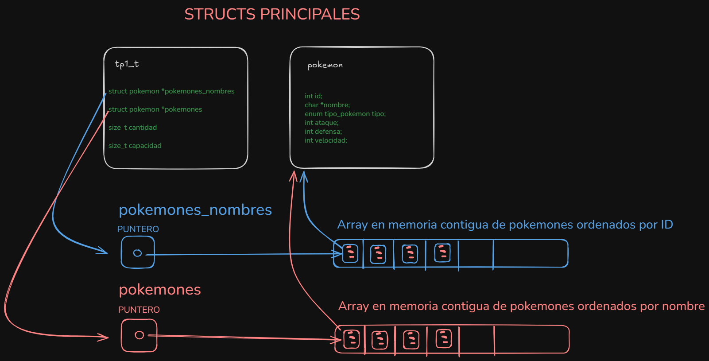

<h1>TP1 (Gestión de Pokemones)</h1>

<h2>Documento explicativo y técnico del Trabajo Práctico 1 (implementación en C).</h2>

<h3>Incluye:</h3>
<ul>
  <li>Descripción general del diseño</li>
  <li>Formato de archivo esperado</li>
  <li>Estructuras de datos usadas</li>
  <li>Explicación de las reservas de memoria</li>
  <li>Descripción función por función (contrato, comportamiento, complejidad y notas)</li>
  <li>Explicación de las primitivas auxiliares</li>
  <li>Casos límite, errores y mejoras sugeridas</li>
</ul>

<h3>1. Resumen general</h3>

La implementación gestiona colecciones de pokemon cargadas desde un archivo CSV. Cada pokemon tiene: id (entero), nombre (string dinámico), tipo (enum), y atributos numéricos ataque, defensa, velocidad.

El módulo expone operaciones típicas sobre conjuntos ordenados: lectura/escritura desde archivo, consultas por nombre e id, iteración, y operaciones de conjuntos (unión, intersección, diferencia). Internamente se mantiene la colección en dos arreglos dinámicos:
<ul>
  <li>pokemones — arreglo de struct pokemon ordenado por id (ascendente).</li>
  <li>pokemones_nombres — arreglo de struct pokemon ordenado por nombre (lexicográfico ascendente).</li>
</ul>

Mantener ambas vistas permite búsquedas binarias eficientes por id y por nombre, y operaciones de conjunto tipo "merge" en tiempo lineal.

<h3>2. Formato CSV esperado</h3>

Cada línea del CSV debe tener 6 campos separados por comas:

    <id>,<nombre>,<TIPO>,<ataque>,<defensa>,<velocidad>\n

Donde <TIPO> es una cadena entre: ELEC, FUEG, PLAN, AGUA, NORM, FANT, PSI, LUCH. Líneas que no cumplan el formato (menos de 6 campos) se ignoran.

<h3>3. Estructuras y representación en memoria</h3>

  <h4>struct pokemon</h4>

Contiene los campos:
<ul>
  <li>int id: identificador único.</li>
  <li>char *nombre: puntero a una copia dinámica del nombre (alocada con mi_strdup).</li>
  <li>enum tipo_pokemon tipo: tipo del pokemon.</li>
  <li>int ataque, defensa, velocidad: atributos.</li>
</ul>

Observación: la implementación guarda una copia del nombre (malloc) por cada pokemon que se incluye en la colección. Internamente la misma dirección del nombre puede aparecer en ambos arreglos (se copia la estructura, pero el char * apunta al mismo bloque), por eso el destructor detecta y libera cada nombre una sola vez.

<h4>struct tp1 (oculto)</h4>

Campos relevantes:
<ul>
  <li>struct pokemon *pokemones — arreglo dinámico (contiguo) ordenado por id.</li>
  <li>struct pokemon *pokemones_nombres — arreglo dinámico ordenado por nombre.</li>
  <li>size_t cantidad — número actual de pokemones almacenados.</li>
  <li>size_t capacidad — capacidad actual (nº de elementos que caben antes de redimensionar).</li>
</ul>

Diseño: se usan DOS arreglos contiguos (struct pokemon[]) por dos razones principales:
<ul>
  <li>Búsqueda binaria rápida (random access) tanto por id como por nombre.</li>
  <li>Iteración muy eficiente y uso de memoria compacta (localidad de referencia).</li>
</ul>

Redimensionado: la capacidad inicial es 10 y al llenarse se duplica (factor 2). Esta estrategia proporciona un comportamiento amortizado O(1) por inserción en lo que respecta al coste de reserva.

<h3>4. Reservas y gestión de memoria</h3>

Resumen de principales reservas:
<ul>
  <li>tp1_t (estructura principal): malloc(sizeof(tp1_t)).</li>
  <li>Arreglos: malloc(capacidad * sizeof(struct pokemon)) para ambas vistas.</li>
  <li>nombre de cada pokemon: mi_strdup hace malloc(strlen+1) y copia.</li>
  <li>leer_linea(FILE*): buffer dinámico que duplica su capacidad cuando es necesario (estrategia cap *= 2).</li>
</ul>

<h4>Por qué así:</h4>
<ul>
  <li>Arreglos dinámicos con duplicación son simples y eficientes en la práctica; minimizar multiplicaciones de memoria y mantener datos contiguos.</li>
  <li>mi_strdup asegura que cada nombre vive en memoria propia y no apunta a buffers temporales.</li>
  <li>Duplicar la estructura pokemon en ambos arreglos pero compartir el nombre permite mantener ordenamientos distintos sin duplicar el contenido de texto (solo se duplica el puntero en la estructura).</li>
</ul>

Liberación: el destructor busca todas las direcciones nombre únicas (usando comparación de punteros) para free-ear cada char* una sola vez y evitar double free. Si la reserva auxiliar falla, tiene un fallback que libera los nombres encontrados en un arreglo principal.

<h3>5. Documentación de funciones</h3>

        Nota: las firmas están en tp1.h y la implementación en tp1.c.
<ul>
  <li><h4>tp1_t *tp1_leer_archivo(const char *nombre)</h4></li>
  <ul>
    <li>Qué hace: lee el CSV indicado por nombre y construye la estructura tp1_t con los pokemones válidos.</li>
    <li>Parámetros: const char *nombre — ruta del archivo de entrada.</li>
    <li>Retorno: puntero a tp1_t con los datos si todo OK, o NULL en caso de error (archivo inex., error de memoria, etc.).</li>
    <li>
      Comportamiento clave:
      <ul>
        <li>Lee línea a línea con leer_linea (buffer dinámico).</li>
        <li>Parsea con sscanf(..."%d,%[^,],%[^,],%d,%d,%d"...).</li>
        <li>Ignora líneas mal formadas o con tipo no reconocido.</li>
        <li>Evita IDs repetidos buscando por id (binaria) antes de insertar.</li>
        <li>Crea mi_strdup(nombre) y construye struct pokemon p.</li>
        <li>Inserta en ambos arreglos con insertar_ordeando (por id) y insertar_nombre_ordenado (por nombre). La incremetación de cantidad la hace insertar_nombre_ordenado.</li>
        <li>Si falla cualquier reserva, libera lo ya reservado y devuelve NULL.</li>
      </ul>
    </li>
    <li>
      Complejidad temporal:
      Sea m el número de líneas/entradas procesadas y n el número final de pokemones almacenados. Cada inserción hace: tp1_buscar_id (O(log k) con k elementos actuales) + insertar_ordeando (desplazar elementos → O(k)) + insertar_nombre_ordenado (desplazar → O(k)).
<h4>Por tanto, en el peor caso (entradas desordenadas) el coste dominante es el de los desplazamientos por inserción: Θ(n²)</h4>
Además, las redimensiones por duplicación de capacidad implican copias periódicas con coste amortizado O(n) en total.
    </li>
    <li>Memoria: O(n) espacio (dos arreglos de struct pokemon más n nombres en heap).</li>
  </ul>

<h4>Notas/observaciones:</h4>
<ul>
  <li>insertar_ordeando no incrementa cantidad por diseño (la incrementa la inserción por nombre). Si se reutiliza esta función fuera del flujo actual hay que tener cuidado.</li>
  <li>sscanf usa buffers estáticos locales (nombre_poke[25656]) — si una línea supera ese tamaño habría riesgo; en la práctica ese tamaño es grande pero no infinito.</li>
  <li>parsear_string_tipo devuelve -1 para tipo inválido; en el código original se guarda el resultado en una variable char tipo — sería más correcto usar enum tipo_pokemon tipo o int para evitar problemas de signo/tamaño.</li>
</ul>

<h4>size_t tp1_cantidad(tp1_t *tp1)</h4>

Qué hace: devuelve tp1->cantidad.

Complejidad: O(1).

Notas: devuelve 0 si tp1 == NULL.

tp1_t *tp1_guardar_archivo(tp1_t *tp1, const char *nombre)

Qué hace: escribe todos los pokemones en tp1->pokemones (orden por id) al archivo nombre, en el mismo formato CSV que tp1_leer_archivo acepta.

Complejidad: O(n) tiempo (escritura de n líneas). Espacio auxiliar O(1).

Retorno: tp1 en caso de éxito, NULL si tp1==NULL o no puede abrir el archivo.
</ul>

tp1_t *tp1_union(tp1_t *un_tp, tp1_t *otro_tp)

Qué hace: construye un nuevo tp1 que representa la unión por id de ambos conjuntos. Si hay repetidos se prefiere el elemento de un_tp.

Implementación: algoritmo "merge" de dos arreglos ordenados por id (dos punteros i, j). Para cada elemento elegido se clona la estructura y se duplica el nombre con mi_strdup.

Complejidad: O(n + m) tiempo (n = |un_tp|, m = |otro_tp|) + coste de copias de strings (sum(L_i)). Espacio: O(n + m) para el nuevo arreglo.

Notas: res->pokemones_nombres queda como NULL en la implementación; el resultado no tiene la vista por nombre construida. Si se requiere buscar por nombre en el resultado, hay que construir pokemones_nombres (por ejemplo, creando un arreglo de punteros y ordenándolo, o insertando ordenadamente y actualizando cantidad).

tp1_t *tp1_interseccion(tp1_t *un_tp, tp1_t *otro_tp)

Qué hace: devuelve un nuevo tp1 con los pokemones que estén en ambos conjuntos (igual id).

Implementación: merge two-pointer aprovechando orden por id.

Complejidad: O(n + m) tiempo, O(k) memoria (k = tamaño de la intersección).

Notas: idem a union — pokemones_nombres queda NULL.

tp1_t *tp1_diferencia(tp1_t *un_tp, tp1_t *otro_tp)

Qué hace: devuelve los pokemones que están en un_tp pero no en otro_tp (por id).

Complejidad: O(n + m) tiempo, O(n) memoria en peor caso.

Notas: idem con pokemones_nombres.

struct pokemon *tp1_buscar_nombre(tp1_t *tp, const char *nombre)

Qué hace: busca un pokemon por nombre en pokemones_nombres mediante búsqueda binaria.

Complejidad: O(log n) comparaciones de strings; cada comparación strcmp es O(L) donde L es la longitud del nombre comparado, por lo que el coste es O(L · log n).

Precondiciones: tp no nulo, tp->cantidad > 0, tp->pokemones_nombres != NULL y nombre != NULL.

Retorno: puntero al struct pokemon dentro del arreglo pokemones_nombres, o NULL si no se encuentra.

struct pokemon *tp1_buscar_id(tp1_t *tp, int id)

Qué hace: busca por id usando búsqueda binaria en pokemones.

Complejidad: O(log n).

Retorno: puntero a la entrada en tp->pokemones o NULL.

size_t tp1_con_cada_pokemon(tp1_t *un_tp, bool (*f)(struct pokemon *, void *), void *extra)

Qué hace: aplica la función f a cada pokemon según orden por id (desde i=0 a cantidad-1). Si f devuelve false, la iteración se detiene.

Complejidad: O(k) donde k es el número de pokemones realmente visitados (hasta cantidad).

Retorno: cantidad de pokemones sobre los que se aplicó f.

void tp1_destruir(tp1_t *tp1)

Qué hace: libera toda la memoria asociada a tp1, incluyendo los char *nombre (sin doble free).

Algoritmo: recorre ambos arreglos, construye una tabla auxiliar unicos con las direcciones nombre detectadas y free-ea cada una una sola vez. Si no puede reservar unicos, tiene un fallback que libera los nombre presentes en un arreglo principal.

Complejidad: en el peor caso la detección de duplicados se hace mediante búsqueda lineal en unicos para cada nombre, por lo que el tiempo es O(n²) en el peor caso. Espacio extra O(k) para el array unicos.

6. Primitivas auxiliares (explicación detallada)
leer_linea(FILE *f)

Lee la entrada carácter a carácter con fgetc, creciend
