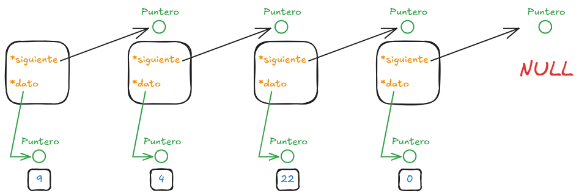
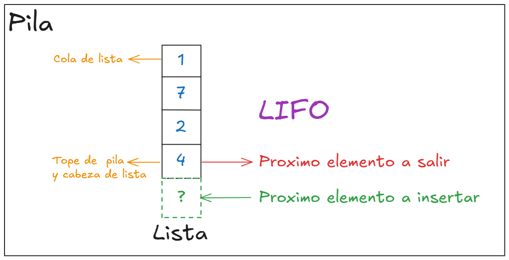
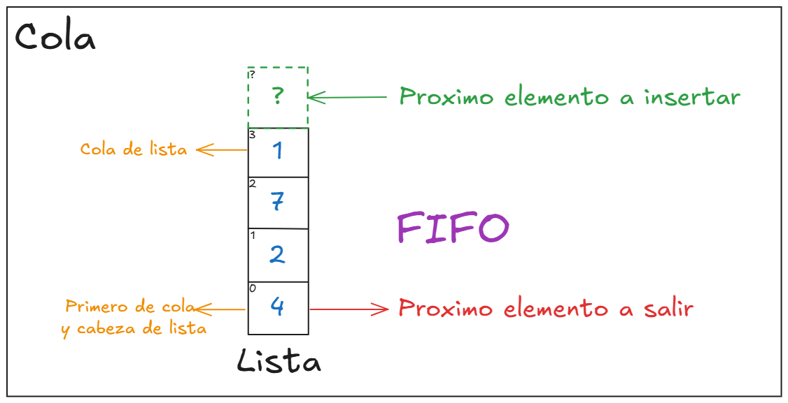
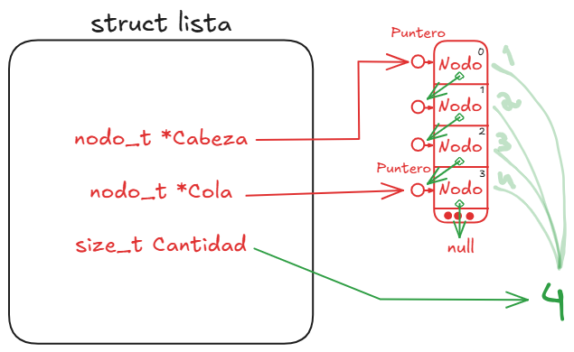
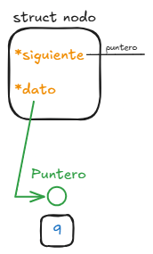
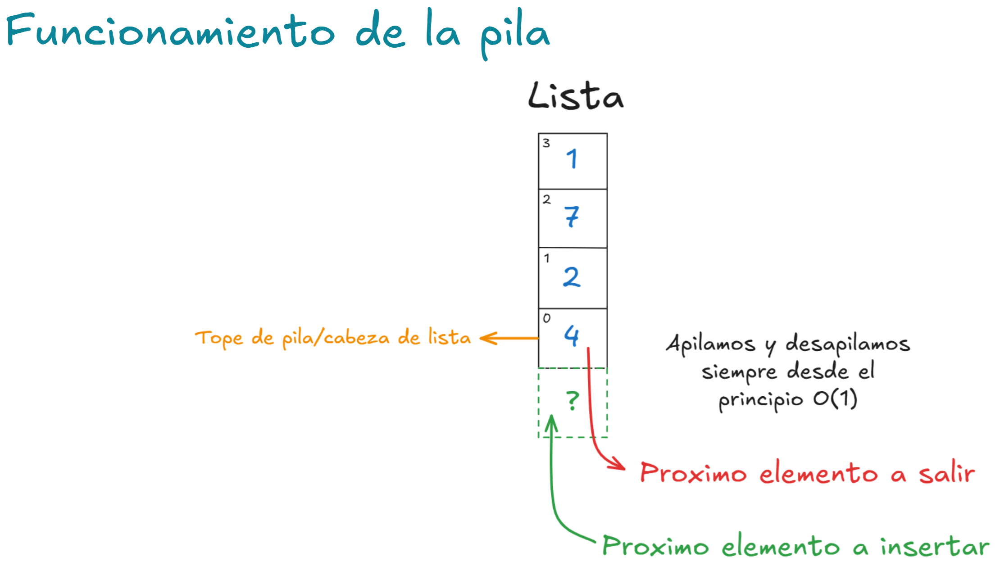

# TDA LISTA/PILA/COLA

## Repositorio de Tomás Bobbett - 110560 - Tomas_Bobbett@hotmail.com

- Para compilar: Estando en el directorio principal

```bash
gcc -Wall -Werror -Wconversion -std=c99 src/..c sarasa.c -o sarasa
```

- Para ejecutar:

```bash
./sarasa
```

- Para ejecutar con valgrind:
```bash
valgrind --leak-check=full --track-origins=yes ./sarasa
```
---
<h2>Funcionamiento</h2>

El trabajo práctico implementa tres estructuras de datos clásicas: lista, pila y cola. Todas ellas se basan en el mismo TDA lista, y cada estructura define operaciones propias 
a partir de las primitivas implementadas.

La lista es una <b>lista enlazada dinámica</b>, donde cada nodo contiene un puntero genérico a un dato y un puntero al siguiente nodo. Permite insertar y eliminar en cualquier
posición, buscar algun elemento en cualquier posicion, encontrar el numero de posicion de un elemento o recorrer la secuencia e iterar de manera interna y externa.


<div align="center">

</div>


La pila está implementada sobre la lista, utilizando la inserción y eliminación al principio para respetar la política LIFO (last in, first out) y la complejidad pedida O(1). Sus operaciones principales son apilar, desapilar, ver_tope y cantidad.


<div align="center">

</div>


La cola también se apoya en la lista, pero opera con inserciones al final y eliminaciones al principio, cumpliendo la política FIFO (first in, first out) y la complejidad pedida O(1). Sus operaciones principales son encolar, desencolar, ver_primero y cantidad.


<div align="center">

</div>

<h2>Reservas de memoria realizadas:</h2>
<ul>
    <li>Al crear la lista, necesitamos reservar un bloque de memoria del tamaño del struct de la lista, que contiene punteros a cabeza, cola y la cantidad de elementos. Esto lo hacemos porque la lista debe persistir en memoria mientras se use, así que se reserva dinámicamente, para tener un objeto que represente la lista completa y sirva como "manejador" (puntero que se pasa a todas las funciones).</li>
    
    lista_t *res = malloc(sizeof(lista_t));
<li>Cuando el usuario quiere insertar algo en la lista, lo que ocurre internamente es que se crea un nuevo nodo y este se agrega donde deba ir, ya con su siguiente cargado y con su dato. Para eso debemos reservar memoria para el mismo(estructura con dato y siguiente).</li>
        
    nodo_t *nodo_res = malloc(sizeof(nodo_t));
<li>Por ultimo cuando se crea el iterador tambien debemos reservar memoria para la estructura del iterador, que guarda el puntero al nodo actual. El iterador es un objeto independiente que puede coexistir con la lista y se crea dinámicamente para ser destruido luego de usarlo.</li>

    lista_iterador_t *iterador = malloc(sizeof(lista_iterador_t)); 
</ul>
<h2>Liberaciones de memoria:</h2>
Cada vez que hacemos un "malloc" para reservar un bloque de memoria, chequeamos si la reserva de la misma ocurrio satisfactoriamente. Si esto no ocurre hacemos free("nombre de objeto")
para no tener perdidas de memoria.

    if (!res) {
		free(res); <-------LIBERACION DE MEMORIA RESERVADA
		return NULL;
	}
    
<h2>En cuanto a decisiones de implementación:</h2>
<ul>
    <li>Para el struct de la lista decidi incluir 3 elementos, puntero a la cabeza de la lista, puntero a la cola de la lista y por ultimo la cantidad de elementos en la lista.</li>

<div align="center">

</div>
    <li>Para el struct del nodo solo tenemos dos elementos, puntero al siguiente nodo y el dato que contiene el mismo.</li>
   <div align="center">

</div>
    <li>Se eligio insertar al principio y agregar al principio en la pila porque si haciamos el orden correspondiente de la pila (poner al final y sacar al final) nos queda en O(n) ya que eliminar al final de una lista SIMPLEMENTE enlazada cuesta O(n).</li>
   <div align="center">

</div>
    <li>Para el caso del struct del iterador externo de la lista solo tenemos un elemento, un puntero el nodo actual que estamos iterando</li>
    --------------------IMAGEN STRUCT ITERADOR DE LISTA-----------------------------------
    <li>Para la liberación de memoria se creó una primitiva lista_destruir_todo que recibe un destructor de datos para evitar fugas de memoria cuando los elementos almacenados también fueron reservados dinámicamente.</li>
</ul>

## Respuestas a las preguntas teóricas
<h3>1. Explicar qué es una lista, lista enlazada y lista doblemente enlazada:</h3>
Una lista a secas es un conjunto ordenado de objetos donde cada posición tiene un elemento, pero una lista enlazada 
es un tipo de dato abstracto (TDA) que es representado por medio de nodos conectados en una sola direccion (simplemente enlazada). 

-------------------IMAGEN DE LISTA ENLAZADA GENERAL------------------------------

Cada uno de estos nodos tiene un puntero al siguiente nodo en la lista (si este es el ultimo su siguiente seria NULL)
y tambien contiene el puntero al dato en si q almacen el nodo.

-------------------IMAGEN DE NODO SOLO----------------------------------

La diferencia entre la lista SIMPLEMENTE enlazada y la DOBLEMENTE enlazada esta en, como indica el nombre, la cantidad de direcciones en que se puede mover de un nodo a otro. 

-------------------IMAGEN LISTA SIMPLE Y DOBLE-------------------------

Sus caracteristicas son que la lista simple tiene una sola direccion, por lo que solo se puede recorrer para un solo lado. En 
cambio, en la doble se puede ir en dos direcciones (adelante y atras).
Esto es una ventaja hablando de complejidad, pero tambien es una desventaja al ser mas complicado de implementar. Esto ocurre ya que
el nodo de la doblemente enlazada tiene un puntero de mas para el nodo anterior, mientras que los nodos de la simplemente 
enlazada solo tiene uno para su siguiente.

-------------------IMAGEN DIFERENCIA DE NODOS--------------------------


La ventaja en la complejidad esta en la primitiva de eliminar al final, siendo O(n) en la lista simplemente enlazada, pero O(1) en la
doble. ¿Por que? a la hora de eliminar al final de la lista simplemente enlazada, necesitamos tener dos nodos, primero el ultimo y
luego su anterior para actualizar la cola de la lista, pero... ¿como hacemos para voler para atras? ¡No se puede! Habria que volver a 
recorrer tooda la lista para conseguir este nodo, por eso su complejidad O(n). En cambio, la ventaja de la lista doblemente enlazada al 
tener un puntero al nodo anterior, permite el acceso a este en O(1). Por lo que la complejidad para eliminar es O(1).

<h3>2.Explicar qué es una lista circular y de qué maneras se puede implementar.</h3>
Una lista circular es una lista en la que el último nodo apunta nuevamente al primero, formando un ciclo cerrado.

-----------------IMAGEN DE LISTA CIRCULAR GENERAL----------------------

Puede implementarse como lista simple (la cola apunta a la cabeza) o como lista doble (la cola apunta a la cabeza y la cabeza al final).

-----------------IMAGEN DE LISTA CIRCULAR DOBLEMENTE ENLAZADA-----------

Se usa cuando se necesita un recorrido infinito, como en sistemas de turnos o buffers circulares.

<h3>3.Explicar la diferencia de funcionamiento entre cola y pila.</h3>
Una cola es una estructura FIFO (first in, first out), donde el primer elemento en entrar es el primero en salir, como una fila de personas.

-----------------IMAGEN DE DIAGRAMA DE FUNCIONAMIENTO DE LA COLA--------------------------------

Una pila es una estructura LIFO (last in, first out), donde el último en entrar es el primero en salir, como una pila de platos.

-----------------IMAGEN DE DIAGRAMA DE FUNCIONAMIENTO DE LA PILA--------------------------------

La diferencia está en el orden de extracción y en las operaciones principales: en la cola se encola y desencola, en la pila se apila y desapila.

<h3>4.Explicar la diferencia entre un iterador interno y uno externo.</h3>
Un iterador interno es una función que recorre la estructura por dentro, aplicando otra función a cada elemento sin que el usuario tenga control del paso a paso.
Un iterador externo en cambio le da al usuario el control para avanzar manualmente sobre los elementos con operaciones como avanzar() o hay_siguiente().
El interno es más simple de usar, pero el externo brinda mayor flexibilidad porque se puede detener el recorrido en cualquier punto.
